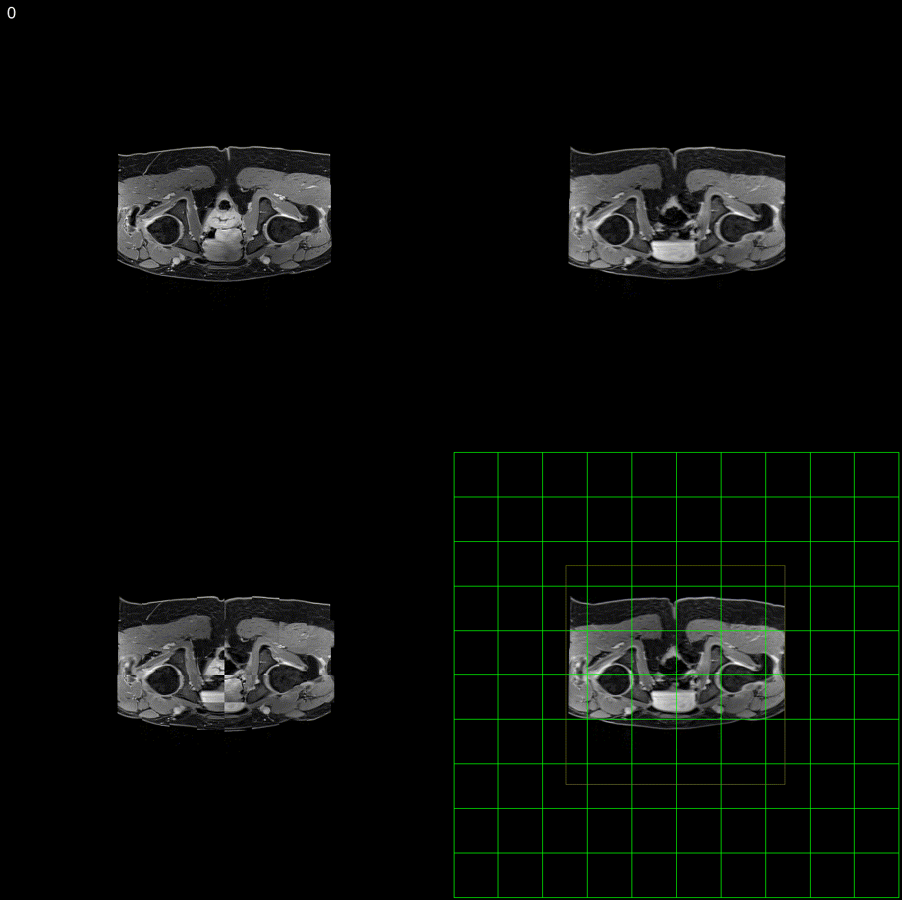

# Image Registration Based on mPlus (v1.2)


This project implements a multi-metric registration strategy that combines Mutual Information (MI), Normalized Gradient Field (NGF), Mean Squared Error (MSE), and Normalized Correlation (NC) techniques. Developed using the Insight Segmentation and Registration Toolkit (ITK), this method is specifically designed for applications in pediatric oncology.

Pediatric oncology presents a particularly challenging scenario for image registration. Children's brains undergo significant anatomical changes as they grow, and these changes are further complicated by treatment-induced deformations—such as those caused by hydrocephalus or surgical interventions—which can result in nonuniform and unpredictable alterations in tissue structure. Traditional registration methods often struggle to accurately align images acquired across extended periods, as they may not adequately account for these rapid and heterogeneous changes. To address these challenges, our multi-metric registration strategy leverages ITK's powerful and flexible framework to integrate MI for robust intensity-based alignment, NGF to capture spatial gradients and edge information, MSE for direct intensity matching, and NC for correlation-based alignment. This complementary approach is specifically designed for pediatric oncology, where precise image registration is essential for tracking treatment outcomes and correlating radiotherapy dose with neurocognitive effects over long-term follow-up.


For a detailed description of the method, please refer to our article:  
[A multi-metric registration strategy for the alignment of longitudinal brain images in pediatric oncology](https://link.springer.com/article/10.1007/s11517-019-02109-4)

[Publication list](https://biodimensional.com/)



## Features

- **Multi-metric registration:** Combines MI, NGF, MSE, NC, GD, and NMI to optimise registration accuracy.
- **Composite cost function:** `V = α·MI + λ·NGF + ν·MSE + ζ·NC + ρ·GD + σ·NMI + κ·LabelDist`.
- **Non-rigid 3D registration:** B-spline transform efficiently handles deformations in brain images.
- **Rigid & affine transforms:** Similarity (7-DOF) and affine (12-DOF) transforms for global alignment.
- **Multi-resolution affine:** `3DRegAffineMultiLevel` applies a coarse-to-fine multi-resolution pyramid to the affine registration.
- **Three derivative-merging modes:**
  - *Mode 0 (consistent)* — raw weighted sum, safe for all optimisers including LBFGS-B. **(default)**
  - *Mode 1 (normalised)* — normalise each metric gradient to unit length before merging; suitable only for gradient-descent optimisers.
  - *Mode 2 (main-metric adaptive)* — automatically scale all gradients to match one designated "main" metric's magnitude, then merge; safe for LBFGS-B and frees the user from manual weight tuning.
- **Modality presets:** `--modality multimodal` (MI+NGF) or `--modality singlemodal` (MSE+NC) apply sensible default weights; any weight explicitly supplied on the command line overrides the preset.
- **Iteration snapshot observer:** Save mid-axial PNG (fixed | resampled | checkerboard) or full 3D NIfTI volumes at configurable iteration intervals.
- **Label map / ROI support:** Optionally provide integer label maps (segmentations) for both fixed and moving images to:
  - **Monitor registration quality:** Per-label Sørensen–Dice coefficient is printed at every N iterations, giving real-time feedback on how well structural regions are aligning.
  - **Guide the optimiser:** A signed-distance-transform term (κ) can be added to the composite metric and its analytical derivative, so label boundary information directly influences the optimisation.
- **Multithreading support:** Accelerates computation for large 3D datasets.
- **Version flag:** All executables accept `--version` to print the version string and exit.
- **Open source:** Freely available for research and development.

## Installation

### Prerequisites

Make sure your system has the following dependencies installed. You can install them using the commands below:

```bash
sudo apt-get update
sudo apt-get install -y cmake build-essential libinsighttoolkit4-dev
sudo apt-get install -y libpng-dev libjpeg-dev libtiff-dev libdcmtk-dev libfltk1.3-dev libeigen3-dev
sudo apt-get install -y libboost-all-dev
```

## Building
```bash
git clone https://github.com/erosmontin/registrationMplus.git
cd registrationMplus
mkdir build && cd build
cmake ../src
make -j4
```

The four executables are placed in `build/bin/`:
- `3DRegSimilarity` — Similarity (7-DOF) registration
- `3DRegAffine` — Affine (12-DOF) registration
- `3DRegAffineMultiLevel` — Multi-resolution affine (12-DOF) registration
- `3DRegBsplines` — Non-rigid B-spline registration

---

## Registration Executables

All four programmes share the same `itkMplus` composite metric and most CLI options. They differ in the **transform model** and **optimiser**.

| Executable | Transform | DOF | Optimiser | Typical use |
|---|---|---|---|---|
| `3DRegSimilarity` | `Similarity3DTransform` | 7 (3 rotation + 3 translation + 1 uniform scale) | Regular-Step Gradient Descent (RSGD) | Quick global alignment with isotropic scaling |
| `3DRegAffine` | `AffineTransform` | 12 (9 matrix + 3 translation) | RSGD | Full linear alignment (rotation, translation, scaling, shearing) |
| `3DRegAffineMultiLevel` | `AffineTransform` | 12 | Multi-resolution RSGD | Coarse-to-fine affine; better convergence basin |
| `3DRegBsplines` | `BSplineTransform` (cubic) | Grid-dependent | LBFGS-B (quasi-Newton) | Non-rigid local deformation recovery |

A typical workflow registers images in order of increasing flexibility:  
1. `3DRegSimilarity` for coarse alignment  
2. `3DRegAffine` (or `3DRegAffineMultiLevel`) for full affine correction, warm-started with `-W` from the similarity transform  
3. `3DRegBsplines` initialised from the affine transform for non-rigid refinement

> **Cross-transform warm-start:** The `-W` flag on `3DRegAffine` / `3DRegAffineMultiLevel` automatically converts any linear transform (e.g. `Similarity3DTransform` written by `3DRegSimilarity`) to an `AffineTransform` by extracting the matrix, offset, and centre via the common `MatrixOffsetTransformBase` interface.

---

## Common Options (all executables)

### Image I/O

| Short | Long | Default | Description |
|-------|------|---------|-------------|
| `-f` | `--fixedimage` | **required** | Fixed image filename |
| `-m` | `--movingimage` | **required** | Moving image filename |
| `-o` | `--outputimage` | **required** | Output registered image filename |
| `-v` | `--vfout` | `N` | Deformation field output filename (`N` = skip) |
| `-T` | `--transformout` | `N` | Write output transform to file (`N` = skip) |
| `-W` | `--transformin` | `N` | Initialise from existing transform file (`N` = identity). Accepts any linear ITK transform (e.g. `Similarity3DTransform`, `AffineTransform`); auto-converts when the type differs from the target executable's native transform. |

### Metric Weights

| Short | Long | Default (Aff/Sim) | Default (Bsp) | Description |
|-------|------|-------------------|---------------|-------------|
| `-a` | `--alpha` | `1.0` | `1.0` | MI metric weight (α) |
| `-A` | `--alphaderivative` | `1.0` | `1.0` | MI derivative weight |
| `-l` | `--lambda` | `1.0` | `0` | NGF metric weight (λ) |
| `-L` | `--lambdaderivative` | `0` | `0` | NGF derivative weight |
| `-n` | `--nu` | `1.0` | `0` | MSE metric weight (ν) |
| `-N` | `--nuderivative` | `1.0` | `0` | MSE derivative weight |
| `-y` | `--yota` | `0` | `0` | NC metric weight (ζ) |
| `-Y` | `--yotaderivative` | `0` | `0` | NC derivative weight |
| | `--rho` | `0` | `0` | GD metric weight (ρ) — Gradient Difference |
| | `--rhoderivative` | `0` | `0` | GD derivative weight |
| | `--sigma` | `0` | `0` | NMI metric weight (σ) — Normalized Mutual Information |
| | `--sigmaderivative` | `0` | `0` | NMI derivative weight |

> **Note:** `3DRegBsplines` defaults to MI-only (`λ=ν=ζ=ρ=σ=0`). Set derivative weights > 0 to include a metric in the gradient.

### Metric Sampling

| Long | Default | Description |
|------|---------|-------------|
| `--mattespercentage` (`-p`) | `0.1` | Fraction of voxels for Mattes MI |
| `--mattesnumberofbins` (`-b`) | `64` | Histogram bins for Mattes MI |
| `--explicitPDFderivatives` | `false` | Use explicit PDF derivatives for MI |
| `--ngfpercentage` | `0.1` | Fraction of voxels for NGF |
| `--msepercentage` | `0.1` | Fraction of voxels for MSE |
| `--ncpercentage` | `0.1` | Fraction of voxels for NC |
| `--nmibins` | `64` | Number of histogram bins for NMI |

### Metric "h" Parameters and Weight Scalers

Two related parameter classes control how individual metrics behave:

- Histogram / noise parameters (the "h" parameters): affect histogram-based metrics or gradient noise tolerance.
  - **MI (Mattes):** `--mattesnumberofbins` / `BinNumbers` (default `64`) — joint-histogram bins for Mattes MI. Larger → finer but noisier estimates.
  - **NMI:** `--nmibins` / `NMIBinNumbers` (default `64`) — joint-histogram bins for Normalized MI.
  - **NGF:** `--etavaluefixed` / `fixed_eta` and `--etavaluemoving` / `moving_eta` (default `-1` = auto; effective typical ≈ `5.0`) — Haber/NGF noise parameters that regularise gradient magnitudes. Larger values tolerate more gradient noise.

- Weight scalers: user-facing weights that scale each metric's contribution in the composite cost and (optionally) its derivative.
  - **MI:** `--alpha` (`α`) and `--alphaderivative` (`α'`) — default `1.0`.
  - **NGF:** `--lambda` (`λ`) and `--lambdaderivative` (`λ'`) — default `1.0` (value) / `0` (derivative).
  - **MSE:** `--nu` (`ν`) and `--nuderivative` (`ν'`) — default `1.0`.
  - **NC:** `--yota` (`ζ`) and `--yotaderivative` (`ζ'`) — default `0.0`.
  - **GD:** `--rho` (`ρ`) and `--rhoderivative` (`ρ'`) — default `0.0`.
  - **NMI:** `--sigma` (`σ`) and `--sigmaderivative` (`σ'`) — default `0.0`.
  - **Label / Kappa:** `--labelkappa` / `LabelKappa` and `--labelkappaderiv` — default `0.0`.

Usage notes:
- Set a metric weight to `0.0` to disable it.
- Use derivative weights to include a metric only in the value or also in the gradient.
- Typical tuning: primary metric ≈ `1.0`, complementary metrics ≈ `0.3–0.7`. Use `--derivativemode 2` for automatic scaling.

### NGF Settings

| Short | Long | Default | Description |
|-------|------|---------|-------------|
| `-r` | `--etavaluefixed` | `-1` | NGF noise estimate for fixed image (−1 = auto) |
| `-s` | `--etavaluemoving` | `-1` | NGF noise estimate for moving image (−1 = auto) |
| | `--NGFevaluator` | `0` | NGF kernel: 0=scalar, 1=cross, 2=scdelta, 3=delta, 4=delta2 |
| | `--ngfspacing` | `4,4,4` | NGF finite-difference spacing per axis in mm (comma-separated) |

### Derivative Merging Modes

| Long | Default | Description |
|------|---------|-------------|
| `--derivativemode` | `0` | Derivative merge strategy: `0`=consistent (LBFGS-B safe), `1`=normalised (RSGD only), `2`=main-metric adaptive (LBFGS-B safe). |
| `--mainmetric` | `0` | Main metric index for mode 2: `0`=MI, `1`=NGF, `2`=MSE, `3`=NC, `4`=Label, `5`=GD, `6`=NMI |

**Mode 0 (consistent):** Each metric gradient is multiplied by its user-supplied weight and summed directly. The value function uses the same weights, ensuring `V` and `∇V` are consistent—required for quasi-Newton optimisers like LBFGS-B.

**Mode 1 (normalised):** Each metric gradient is normalised to unit length before merging, so user weights control *direction ratios* only. The merged gradient is then rescaled to the weighted average of the original norms. This prevents any single metric from dominating by magnitude but breaks value/derivative consistency—use only with RSGD. **Blocked for `3DRegBsplines`.**

**Mode 2 (main-metric adaptive):** A designated "main" metric (set by `--mainmetric`) serves as the reference scale. Every other metric's gradient is automatically multiplied by `mainNorm / itsNorm` so all gradients operate at comparable magnitudes. The same scale factors are cached and applied to `GetValue()`, preserving value/derivative consistency for LBFGS-B. This frees the user from manually tuning weights to compensate for magnitude differences between metrics.

### Iteration Snapshots

| Long | Default | Description |
|------|---------|-------------|
| `--snapshotdir` | `N` | Directory for iteration snapshots (`N` = off) |
| `--snapshotevery` | `1` | Save a snapshot every N iterations |
| `--snapshotstack` | `false` | `false`=mid-axial 2D PNG; `true`=full 3D `.nii.gz` |
| `--snapshotgrid` | `true` | When enabled, snapshots include a deformation-grid overlay panel. For B-splines, enabling this switches from the real knot mesh to a regular warped pixel grid. |
| `--snapshotgridspacing` | `20` | Grid line spacing in voxels for the deformation overlay (`--snapshotgridspacing 10` → denser lines). Only applies when overlay is a regular deformation grid. |
| `--snapshotlinewidth` | `0` | Overlay line width in pixels. `0` enables adaptive sizing for cleaner, less jagged grid/mesh lines. |

Snapshots (PNG mode) now use a 2×2 layout with the following order:

- (1,1) Fixed (target) image
- (1,2) Registered moving image (resampled with current transform)
- (2,1) Checkerboard (fixed | registered)
- (2,2) Registered moving image with overlay (visualises deformation)

**Overlay behaviour:**
- For **affine/similarity** transforms: bright green warped-grid overlay showing deformation field
- For **B-splines** with `--snapshotgrid=false` (default in the current implementation): renders the actual cubic B-spline control-point mesh (knot lattice) as green lines. The mesh extends beyond the image domain to show all physical control points; a **dim yellow border** marks the original fixed image extent. The first snapshot prints a diagnostic message showing the B-spline mesh bounding box and padding amounts.

All four panels are padded to contain the full B-spline mesh when visible, allowing inspection of out-of-domain control points.

### General

| Short | Long | Default | Description |
|-------|------|---------|-------------|
| | `--numberofthreads` | `2` | Number of CPU threads |
| | `--workingresolution` | `0,0,0` | Internal registration spacing in mm as `x,y,z`. When set to non-zero values, fixed/moving images and label maps are resampled to that working grid before optimisation; final output is still written on the original fixed-image grid. |
| `-t` | `--fixedimagethreshold` | `−99999999` | Only sample fixed voxels above this intensity |
| | `--dfltpixelvalue` | `0` | Fill value for out-of-bounds voxels |
| `-V` | `--verbose` | `false` | Print all parsed options at startup |
| | `--metricoverlap` | `true` | Compute and report image overlap |
| | `--overlappadding` | `20` (Aff/Sim), `3` (Bsp) | **For B-splines:** number of control points to place outside the image domain per side (--overlappadding). Default: `3`. **For other transforms:** voxel padding in metric overlap. Note: ITK's internal B-spline border handling (for basis evaluation) is separate and automatic. |
| | `--metricpadding` | `20` | Overlap padding in voxels for metric evaluation (--metricpadding). Padding around the computed overlap region where metrics are evaluated. |
| | `--version` | | Print version string (`v5.0`) and exit |

### Modality Presets

| Long | Default | Description |
|------|---------|-------------|
| `--modality` | `custom` | Preset: `multimodal` (MI α=1 + NGF λ=0.5), `singlemodal` (MSE ν=1 + NC ζ=0.5), `custom` (manual). GD (ρ) and NMI (σ) default to 0 in all presets. |

When `--modality` is set to `multimodal` or `singlemodal`, sensible default weights are applied automatically. Any weight explicitly supplied on the command line overrides the preset value.

---

## Label Map / ROI Options (all executables)

| Long | Default | Description |
|------|---------|-------------|
| `--fixedlabelmap` | `N` | Fixed-image label map (signed-short NIfTI; `N` = disabled) |
| `--movinglabelmap` | `N` | Moving-image label map (signed-short NIfTI; `N` = disabled) |
| `--labelkappa` | `0.0` | Global weight for the label signed-distance metric value (0 = off) |
| `--labelkappaderiv` | `0.0` | Global weight for the label signed-distance derivative (0 = off) |
| `--labelkappavec` | `""` | Per-label metric weights: `"L1:w1,L2:w2,..."` |
| `--labelkappaderivvec` | `""` | Per-label derivative weights: `"L1:w1,L2:w2,..."` |
| `--labelsamples` | `0.1` | Label metric percentage of pixels used to evaluate the label term (0.1 = 10%) |
| `--labeldistmax` | `20.0` | Clamp signed distances to ±this value (mm) before label loss evaluation |
| `--labelnarrowband` | `false` | Restrict label loss to voxels close to either label boundary |
| `--labelbandwidth` | `5.0` | Narrow-band half-width (mm) used when `--labelnarrowband=true` |
| `--labelhuber` | `false` | Use robust Huber loss on normalized label residuals |
| `--labelhuberdelta` | `0.25` | Huber transition threshold in normalized residual units |
| `--labelreport` | `1` | Print per-label Dice coefficients every N iterations (0 = off) |

When both label maps are provided and all kappa weights are `0.0` (the default), the label term acts as a **monitoring-only** observer — it prints Dice coefficients at each iteration without affecting the optimisation.

The label residual is now normalized and bounded before loss evaluation: both fixed and moving signed distances are clamped to `[-labeldistmax, +labeldistmax]`, then their difference is divided by `labeldistmax`. This keeps the raw label metric numerically stable (avoids exploding values when labels are far apart) and makes `--labelkappa` easier to tune across datasets.

Performance note: if `--labelkappaderiv 0`, moving distance-map gradients are skipped, which significantly reduces label-metric initialization cost.

---

## Executable-Specific Options

### 1. `3DRegSimilarity` — Similarity (7-DOF) Registration

Uses `Similarity3DTransform` (3 rotations, 3 translations, 1 uniform scale) with the `RegularStepGradientDescentOptimizer`.

| Short | Long | Default | Description |
|-------|------|---------|-------------|
| `-I` | `--maxnumberofiterations` | `1000` | Maximum optimiser iterations |
| `-S` | `--minimumsteplength` | `0.1` | Optimiser minimum step length |
| `-X` | `--maximumsteplength` | `1.0` | Optimiser maximum step length |
| `-R` | `--relaxationfactor` | `0.5` | Step-length relaxation factor |
| `-G` | `--gradientmagnitudetolerance` | `1e-4` | Gradient magnitude stopping criterion |

**Example — MI + NGF similarity registration:**
```bash
3DRegSimilarity \
  -f fixed.nii.gz -m moving.nii.gz -o registered.nii.gz \
  -v deformation.nii.gz --numberofthreads 4 \
  -a 1.0 -A 1.0 -l 1.0 -L 1.0 \
  -I 500 -S 0.01 -X 1.0 --derivativemode 0
```

**Example — GD-only similarity registration (singlemodal structural):**
```bash
3DRegSimilarity \
  -f fixed.nii.gz -m moving.nii.gz -o registered.nii.gz \
  --numberofthreads 4 \
  --rho 1.0 --rhoderivative 1.0 \
  -I 500 -S 0.01 -X 1.0
```

**Example — NMI + MI multimodal similarity registration:**
```bash
3DRegSimilarity \
  -f fixed.nii.gz -m moving.nii.gz -o registered.nii.gz \
  --numberofthreads 4 \
  -a 1.0 -A 1.0 --sigma 0.5 --sigmaderivative 0.5 --nmibins 64 \
  -I 500 -S 0.01 -X 1.0
```

---

### 2. `3DRegAffine` — Affine (12-DOF) Registration

Uses `AffineTransform` (9 matrix elements + 3 translations) with the `RegularStepGradientDescentOptimizer`. Supports selecting a transform sub-type to freeze certain degrees of freedom.

| Short | Long | Default | Description |
|-------|------|---------|-------------|
| | `--subtype` | `affine` | Transform sub-type: `translation`, `rotation`, `scaling`, `affine` |
| `-I` | `--maxnumberofiterations` | `1000` | Maximum optimiser iterations |
| `-S` | `--minimumsteplength` | `0.1` | Optimiser minimum step length |
| `-X` | `--maximumsteplength` | `1.0` | Optimiser maximum step length |
| `-R` | `--relaxationfactor` | `0.5` | Step-length relaxation factor |
| `-G` | `--gradientmagnitudetolerance` | `1e-4` | Gradient magnitude stopping criterion |

**Example — full affine MI + MSE registration:**
```bash
3DRegAffine \
  -f fixed.nii.gz -m moving.nii.gz -o registered.nii.gz \
  -T affine_transform.txt --numberofthreads 4 \
  -a 1.0 -A 1.0 -n 1.0 -N 1.0 \
  -I 500 -S 0.01 -X 1.0 --subtype affine
```

**Example — affine MI + NMI multimodal registration:**
```bash
3DRegAffine \
  -f fixed.nii.gz -m moving.nii.gz -o registered.nii.gz \
  -T affine_transform.txt --numberofthreads 4 \
  -a 0.5 -A 0.5 --sigma 1.0 --sigmaderivative 1.0 --nmibins 128 \
  -I 500 -S 0.01 -X 1.0 --subtype affine
```

**Example — affine warm-started from a similarity transform:**
```bash
# Step 1: Run similarity registration
3DRegSimilarity \
  -f fixed.nii.gz -m moving.nii.gz -o sim_registered.nii.gz \
  -T similarity_transform.tfm -I 500

# Step 2: Refine with full affine, initialised from the similarity result
3DRegAffine \
  -f fixed.nii.gz -m moving.nii.gz -o affine_registered.nii.gz \
  -W similarity_transform.tfm -T affine_transform.tfm \
  --numberofthreads 4 -I 500 -S 0.001 -X 1.0
```

---

### 3. `3DRegAffineMultiLevel` — Multi-resolution Affine Registration

Uses `AffineTransform` with the `RegularStepGradientDescentOptimizer` inside a multi-resolution image pyramid. At each pyramid level the images are progressively refined; the optimiser step length is adapted automatically between levels for better convergence.

| Short | Long | Default | Description |
|-------|------|---------|-------------|
| `-U` | `--numberoflevels` | `2` | Number of multi-resolution pyramid levels |
| `-I` | `--maxnumberofiterations` | `1000` | Maximum optimiser iterations (per level) |
| `-S` | `--minimumsteplength` | `0.1` | Optimiser minimum step length |
| `-X` | `--maximumsteplength` | `1.0` | Optimiser maximum step length |
| `-R` | `--relaxationfactor` | `0.5` | Step-length relaxation factor |
| `-G` | `--gradientmagnitudetolerance` | `1e-4` | Gradient magnitude stopping criterion |

**Example — multi-resolution affine MI registration:**
```bash
3DRegAffineMultiLevel \
  -f fixed.nii.gz -m moving.nii.gz -o registered.nii.gz \
  -T affine_transform.txt --numberofthreads 4 \
  -a 1.0 -A 1.0 \
  -U 3 -I 500 -S 0.01 -X 1.0
```

---

### 4. `3DRegBsplines` — Non-rigid B-spline Registration

Uses a cubic `BSplineTransform` with the `LBFGSBOptimizer` (quasi-Newton). The number of DOF depends on the control-point grid resolution.

> **Important:** Derivative mode 1 (normalised) is **not compatible** with the LBFGS-B optimiser and will be rejected with an error. Use mode 0 or mode 2.

> **B-spline mesh visualization:** When snapshots are enabled (`--snapshotdir`), the overlay panel displays the actual cubic B-spline control-point mesh. The mesh is positioned correctly relative to the anatomy regardless of image direction (e.g. negative direction diagonals in LPS-oriented images are handled automatically). The mesh extends beyond the image domain by `--overlappadding` control points per side; a dim yellow border in the snapshot shows where the original image domain ends. All snapshot panels pad equally to contain the full mesh for inspection.

| Short | Long | Default | Description |
|-------|------|---------|-------------|
| `-g` | `--gridresolution` | `50` | B-spline control-point grid spacing (mm) |
| `-B` | `--bsplinecaching` | `true` | Cache B-spline basis weights for speed |
| | `--meshmarginsize` | `0.0` | Extra margin (mm) added around the image domain for the mesh |
| | `--overlappadding` | `3` | B-spline control points per side outside image domain (--overlappadding). ITK's internal padding for basis evaluation is automatic and separate. |
| | `--metricpadding` | `20` | Overlap padding in voxels for metric evaluation (--metricpadding). |
| `-G` | `--gridposition` | `N` | Read control-point grid positions from file (`N` = auto) |
| `-I` | `--maxnumberofiterations` | `1000` | Maximum optimiser iterations |
| `-F` | `--costfunctionconvergencefactor` | `1e12` | LBFGSB convergence factor (lower = more precise) |
| `-P` | `--projectedgradienttolerance` | `1e-5` | LBFGSB projected-gradient stopping criterion |
| `-E` | `--numberofevaluations` | `500` | Maximum function evaluations |
| `-C` | `--numberofcorrections` | `5` | LBFGSB memory size (L-BFGS correction pairs) |
| | `--bound` | `0` | Bound type per parameter: 0=none, 1=lower, 2=both, 3=upper |
| | `--lbound` | `0` | Lower bound value |
| | `--ubound` | `0` | Upper bound value |

**Default metric weights:** `--lambda 0`, `--nu 0`, `--nuderivative 0`, `--yota 0` (pure MI by default).

**Example — B-spline MI-only registration:**
```bash
3DRegBsplines \
  -f fixed.nii.gz -m moving.nii.gz -o registered.nii.gz \
  -v deformation.nii.gz --gridresolution 50 --numberofthreads 4 \
  -a 1.0 -A 1.0 -p 0.1 -b 64 \
  -F 1e7 -E 500 -C 5
```

**Example — B-spline MI + NGF using main-metric adaptive scaling:**
```bash
3DRegBsplines \
  -f fixed.nii.gz -m moving.nii.gz -o registered.nii.gz \
  --gridresolution 40 --numberofthreads 4 \
  -a 1.0 -A 1.0 -l 1.0 -L 1.0 \
  --derivativemode 2 --mainmetric 0 \
  -F 1e7 -E 500 -C 5
```

**Example — B-spline with GD for singlemodal structural alignment:**
```bash
3DRegBsplines \
  -f fixed.nii.gz -m moving.nii.gz -o registered.nii.gz \
  --gridresolution 40 --numberofthreads 4 \
  --rho 1.0 --rhoderivative 1.0 \
  --derivativemode 2 --mainmetric 5 \
  -F 1e7 -E 500 -C 5
```

**Example — B-spline with label map guidance:**
```bash
3DRegBsplines \
  -f fixed.nii.gz -m moving.nii.gz -o registered.nii.gz \
  --gridresolution 40 --numberofthreads 4 \
  -a 1.0 -A 1.0 \
  --fixedlabelmap fixedLabels.nii.gz --movinglabelmap movingLabels.nii.gz \
  --labelkappa 0.1 --labelkappaderiv 0.1 \
  --labelkappavec "1:1.0,2:0.5,3:0.5" \
  --labelkappaderivvec "1:1.0,2:0.5,3:0.5" \
  --labelsamples 0.1 --labelreport 10
```

**Example — robust, bounded label guidance (recommended when label term dominates):**
```bash
3DRegBsplines \
  -f fixed.nii.gz -m moving.nii.gz -o registered.nii.gz \
  --gridresolution 40 --numberofthreads 4 \
  -a 1.0 -A 1.0 \
  --fixedlabelmap fixedLabels.nii.gz --movinglabelmap movingLabels.nii.gz \
  --labelkappa 0.2 --labelkappaderiv 0.2 \
  --labeldistmax 20 --labelnarrowband true --labelbandwidth 5 \
  --labelhuber true --labelhuberdelta 0.25 \
  --labelsamples 0.1 --labelreport 10
```

Run any executable with `--help` to see the full option list at the command line.

---

## Docker

```bash
docker build -t regsuite .
docker run --rm -v /path/to/data:/data regsuite \
  3DRegBsplines -f /data/fixed.nii.gz -m /data/moving.nii.gz -o /data/out.nii.gz
```

## Singularity

```bash
sudo singularity build regsuite.sif singularity.def
singularity run regsuite.sif \
  3DRegBsplines -f fixed.nii.gz -m moving.nii.gz -o out.nii.gz
```

---

## Notes

- All images should be 3D NIfTI format (`.nii` or `.nii.gz`).
- Label maps must use a **signed short** (`int16`) pixel type. Non-zero integers identify distinct structures; background must be `0`.
- Setting `--labelkappa 0.0` and `--labelkappaderiv 0.0` (the defaults) enables Dice monitoring only, without altering the cost function.
- **GD (Gradient Difference):** The `--rho` metric is based on Sobel-gradient magnitude differences. It is sensitive to image edges and works well for singlemodal structural alignment. GD does not use random voxel subsampling.
- **NMI (Normalized Mutual Information):** The `--sigma` metric uses a joint histogram (bins controlled by `--nmibins`, default 64). It is histogram-based, robust across modalities, and does not use random voxel subsampling. Prefer NMI over standard MI when the intensity relationship is non-linear or when normalised overlap robustness is important.
- The `-P` short flag maps to `--dfltpixelvalue` in Similarity/Affine but to `--projectedgradienttolerance` in B-splines (a B-spline-specific optimiser parameter).
- **v5.0 breaking change:** The legacy `-Z` / `--normalizederivatives` flag has been removed. Use `--derivativemode 1` instead.
- **Cross-transform `-W` support:** `3DRegAffine` and `3DRegAffineMultiLevel` can now warm-start from any linear ITK transform file (e.g. a `Similarity3DTransform` `.tfm` written by `3DRegSimilarity`). The transform is automatically converted to `AffineTransform` at load time. Previously, passing a non-`AffineTransform` file would crash with a segfault.
- **B-spline padding and direction matrices:** ITK's B-spline transform requires control points both inside and outside the image domain for proper basis function evaluation at boundaries. The `--overlappadding` parameter controls how many *physical* control points are placed outside the domain per side. The B-spline domain origin is computed to account for the image direction matrix (which can have negative diagonals, e.g., LPS orientation). ITK internally manages additional border coefficients for numerical stability, separate from `--overlappadding`. When `--snapshotgrid=true`, the actual mesh positions are visualised to allow verification of correct placement.
- **Metric padding (`--metricpadding`):** Separate from B-spline domain padding. Controls voxel padding around the fixed-moving image overlap region where metrics are evaluated. Default is 20 voxels.

## Contributors

See [contributors.txt](contributors.txt).

## Citation

If you use this software in your research, please cite:

```
Montin, E., Belfatto, A., Bologna, M. et al.
A multi-metric registration strategy for the alignment of longitudinal brain images in pediatric oncology.
Med Biol Eng Comput 58, 107–126 (2020).
https://doi.org/10.1007/s11517-019-02109-4
```
